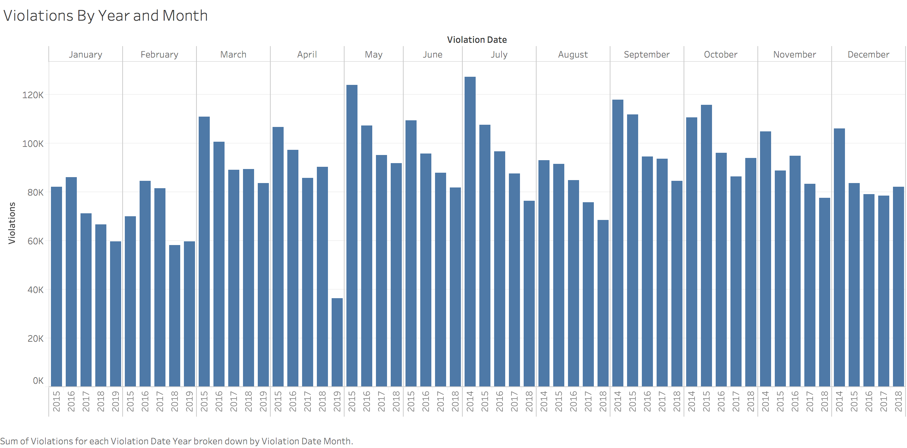
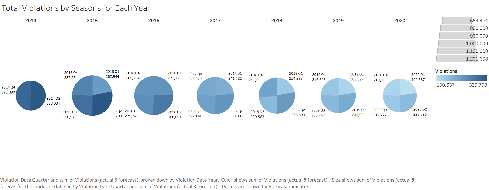
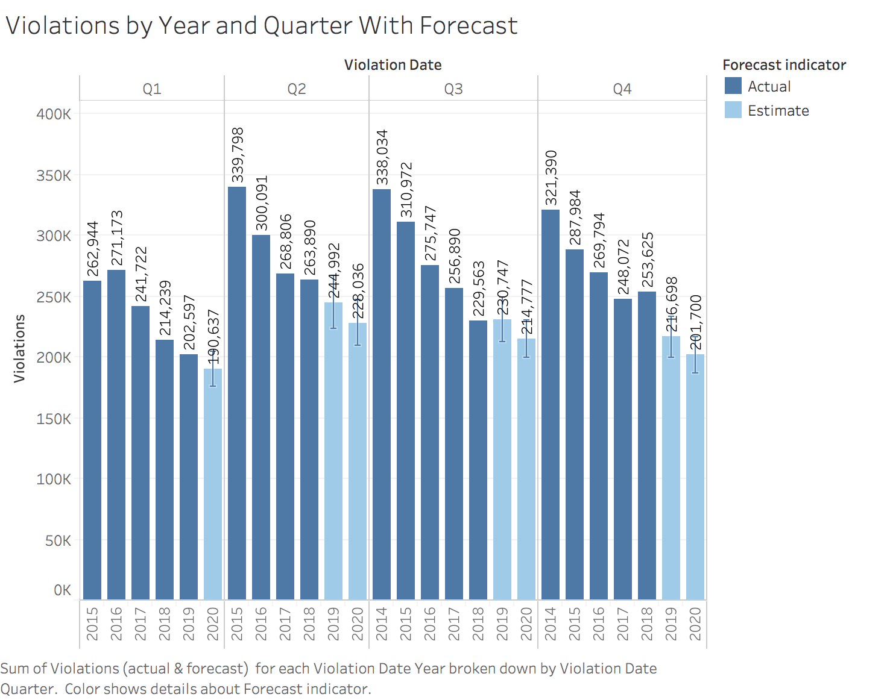
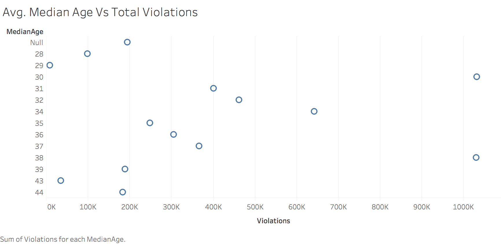
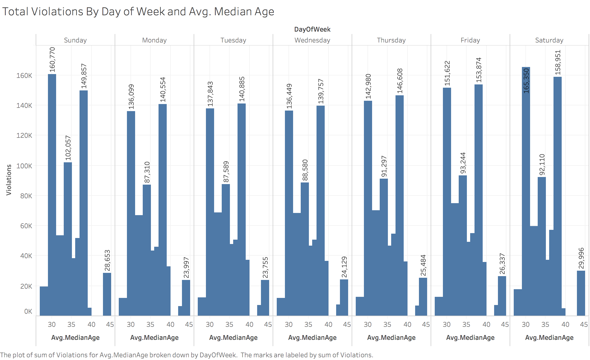

# "Making of" Data Visualization for the Mayor of The City of Chicago.

Chicago experiences roughly 3,000 crashes annually between motor vehicles and pedestrians, about 800 of which involve children.The City of Chicago started enforcing automated speed violations around the children's Safety Zone and violations data is available from 1st of July 2014 [Source](https://www.chicago.gov/city/en/depts/cdot/supp_info/children_s_safetyzoneporgramautomaticspeedenforcement.html)

I have downloaded the speed violations data of the City of Chicago from the [city's website](https://data.cityofchicago.org/Transportation/Speed-Camera-Violations/hhkd-xvj4) which contains speed violations from Q3-2014 to Q1-2019.

I prepared a [visual presentation](https://public.tableau.com/profile/srinivasan.vasudevan#!/vizhome/InduvidualProject-ThreeAspects/ThreeAspects) for the Mayor of the City of Chicago. The visual presents the three important aspects namely interesting story from the data, non-trivial information and unexpected story from the data.

I will dive in to the "making of" this visualization. Unfortunately the zip code information in this Speed violations dataset seems to be incorrect. I downloaded Wards data which contain WARD_ZIPCODE from this [source](https://data.cityofchicago.org/Facilities-Geographic-Boundaries/Ward-Offices/htai-wnw4). I merged the wards data set with speed violations dataset.

## Interesting Story

The first aspect is telling an interesting story from the data. The dataset contains information such as Address of the speed light camera, X and Y co-ordinates of location the camera, Date of Violation, Camera ID, latitude and longitude of camera location. I wanted to give an overview of the data in terms of total violations by "time" to review, how the city has performed over the years since the start of the program. I initially chose the "time" as month, year and a bar graph. This bar graph provided a great detail of the data but it was lot of information to digest. Picture-1 below shows the bar chart. 

I thought showing variations by year and month represents lot of details but the mayor won't be able to make out anything from this. I wanted to try with year and quarter (which best represents seasons). Pie charts are great in representing quadrants. Picture-2 below shows the pie chart. 

This pie chart is not able to reflect the seasonal difference or any improvement over the years or the future forecast accurately. The mayor needs to review this pie chart very closely to understand the details. In a nutshell, this pie chart is not engaging and will not be able to draw attention. A line graph might not be a good choice because it will not be able to tell the magnitude of change for all the years from base 0. 

I think using a bar graph and correctly arranging the columns season first and then year will portray the story well. Picture-3 below shows the Overview in an interesting way..I like the way this graph portrays an interesting story of how the program has been working since the start of the program across various seasons and how it will work in the near future as well. This graph also captures the fact that, in Q3 the forecast for year 2019 is slightly more than Q3 of year 2018.This bar graph shows the decreasing trend of total violations for every quarter across years. This graph also clearly show that, Q1 quarter which is the winter season incurred least violations for all the years. The forecast is also clearly shown with the forecasted number of violations in each years (2019 and 2020).

I ended up using this graph in my presentation.

## Non-trivial Story

The Mayor might be interested in knowing the trend of violations at each zip code.
I initially came up with horizontal bars and zip code wise total violations sorted descending. 

This horizontal bar graph does not depict the trend of violations but just present details of violations by zip code over years. I created another bar graph. 
Well, the above graph is pretty good in capturing the trend (in the last three years), the mayor needs to look very closely to see which zip codes have interesting trends.

I came up with a line graph  to describe this non-trivial story. I created a new parameter called it "color-line". If the total violations in year 2017 is lesser than year 2018, then return 2 otherwise return 1. I also created another parameter called it "Trend" which returned "Red" if its 2 otherwise "Green". Then I used this new attribute "Trend" in the color of the graph. The mayor can also click on "Green" or "Red" in the legend to filter and see only "Red". Here "Red" shows increasing trend in violations in the last year 2018 compared to 2017. I can show the mayor all the increasing trend zip codes in one click. This graph is compelling and persuading the mayor to take further steps to reduce violations in these zip codes. I chose this line graph with trend line over the others to tell this non-trivial and compelling story to the Mayor of Chicago.

## Unexpected Story

Since the speed cameras are speed traps around children safety zones to catch local residents and visitors when commuting in this area, I strongly believe that the local residents will be the major violators for the following reasons. 
* Local residents use these roads on a day to day basis.
* Violations are maximum during Q2,Q3 and Q4 seasons in all the years, which confirm that the local residents start using these parks, children recreation areas in these seasons.
* If the violations are caused by external visitors, then it will be random effect and no pattern will be observed.

Hence I decided to calculate the average median age of residents in all the zip codes present in this speed violations dataset. I web scraped the [url](http://www.city-data.com/zips/60626.html) 
and got the "Resident Median Age" for each zip code. This website provides resident average median age for the year 2016. Since the year 2016 is in the middle , i consider it as the average median age of each zip code. I collected the information for each zip code in the City of Chicago and merged that information with the Speed violations data set.
I came up with initial graph (given below). . This does not portray or convey my concern. 

I came up with another line graph (given below).  This graph is good, but the problem is it's not based from 0. So the magnitude of change or comparison is not effective.

I came up with another bar graph (given below).  When i looked at this graph, I was shocked to see the average median age violators are maximum in the age group between 30 to 40. I was expecting young driver population in the age group 17 to 30 will be the maximum violators. This was in contrary to my belief. I think the mayor will be very much interested to see this graph as he will be willing to take further steps by airing ads and pep talks on road safety and Children safety zone awareness among citizens. I finally chose this bar graph for this unexpected story.

