# Documentation of "Preparation of Three Aspects of Data Visualization on automated speed light violations in the City of Chicago". The actual presentation was for the Mayor of The City of Chicago.

Chicago experiences roughly 3,000 crashes annually between motor vehicles and pedestrians, about 800 of which involve children.The City of Chicago started enforcing automated speed violations around the children's Safety Zone and violations data is available from 1st of July 2014 [Source](https://www.chicago.gov/city/en/depts/cdot/supp_info/children_s_safetyzoneporgramautomaticspeedenforcement.html)

## Data Collection and Preparation

I downloaded the speed violations data from the [city's website](https://data.cityofchicago.org/Transportation/Speed-Camera-Violations/hhkd-xvj4) which contains speed violations from Q3-2014 to Q1-2019.

I prepared a [Visual Presentation](https://public.tableau.com/profile/srinivasan.vasudevan#!/vizhome/InduvidualProject-FinalVersion/FinalVersion) for the Mayor of the City of Chicago. This visual talks about the three important aspects of data visualization namely interesting story from the data, non-trivial information and unexpected story from the data.

I will dive in to the documentation of preparation of this visualization. I used R to process and clean the data. The key attributes from the dataset for our analysis will be:
* Violations -- This stores the violations count
* Latitude   -- Latitude of the camera
* Longitude  -- Longitude of the camera
* Violation Date -- Date of violation
* Wards          -- Ward_Id of the camera location
* Zip Codes      -- Zip code of the camera

The "Zip Codes" information in this Speed violations dataset seems to be incorrect. I downloaded Wards dataset which contain WARD_ZIPCODE from this [source](https://data.cityofchicago.org/Facilities-Geographic-Boundaries/Ward-Offices/htai-wnw4). I merged the wards data set with speed violations dataset using R into one single data table.

Important Note: A ward can have multiple zip codes. But in this case, I saw one ward has one zip code.

So after merge, we will use WARD_ZIPCODE instead of ZipCodes from violations dataset. I will start building the three aspects now.

## Interesting Story

The first aspect is telling an interesting story from the data. I wanted to give an overview of the data with a chart showing violations by "time" for the mayor. This will give the mayor an overview, how the city has performed over the years since the start of the program. I initially chose "time" as year and month. This below bar graph provided a great detail of information but it was lot to digest. Picture-1 below shows the bar chart violations by year and month. 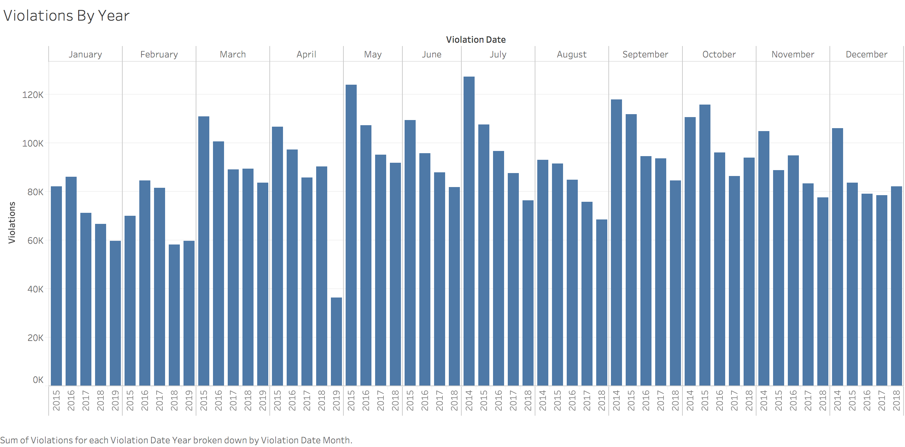

I thought showing variations by year and month represents lot of details but the mayor won't be able to make out anything from this. I wanted to try with year and quarter (best representation for seasons). Picture-2 below shows the pie chart. 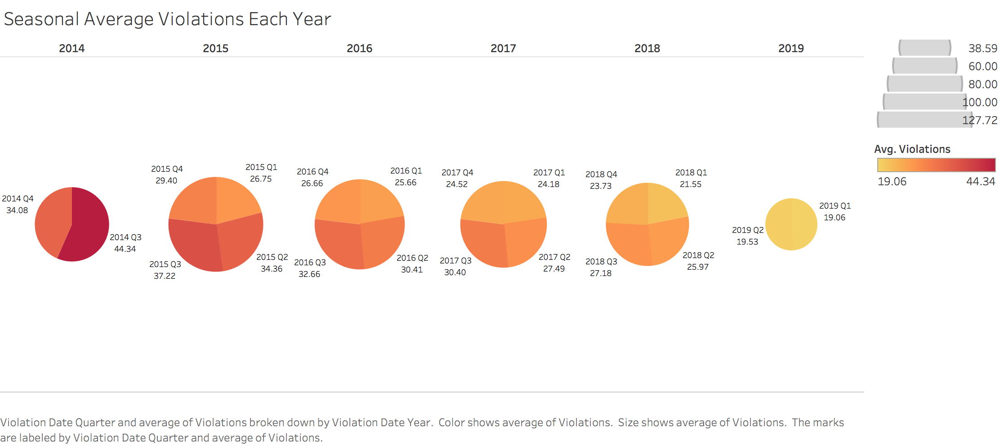

This pie chart is not able to reflect the seasonal difference or any improvement over the years or the future forecast accurately. The mayor needs to review this pie chart very closely to understand the details. In a nutshell, this pie chart is not engaging and will not be able to draw attention. A line graph might not be a good choice because it will not be able to tell the magnitude of change for all the years from base 0.

I think using a bar graph and correctly arranging the columns, season first and then year will portray the story well. Picture-3 below shows the Overview in an interesting way.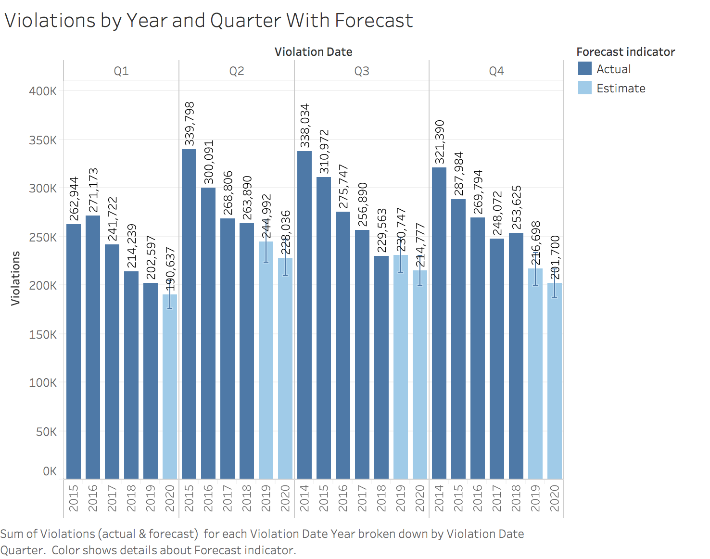 I like the way this graph portrays an interesting story of how the program has been working since the start of the program across various seasons and how it will work in the near future as well. This graph also captures the fact that, in Q3 the forecast for year 2019 is slightly more than Q3 of year 2018.This bar graph shows the decreasing trend of total violations for every quarter across years. This graph also clearly show that, Q1 quarter which is the winter season incurred least violations for all the years. The forecast is also clearly shown with the forecasted number of violations in each years (2019 and 2020). I used this as my first version. 

Here is my question to myself after the first version. Comparing seasons, what is the message from this graph? Of all the seasons, Q2 consistently beats other seasons in all years? Can we show the decreasing trend or rate and explain to the mayor the following things.
1. The overall trend in all years and seasons.
2. Season wise decreasing rate and how they perform in comparison to each other.

I thought of line graph with trend, forecast features and showing actual and forecast in different colors.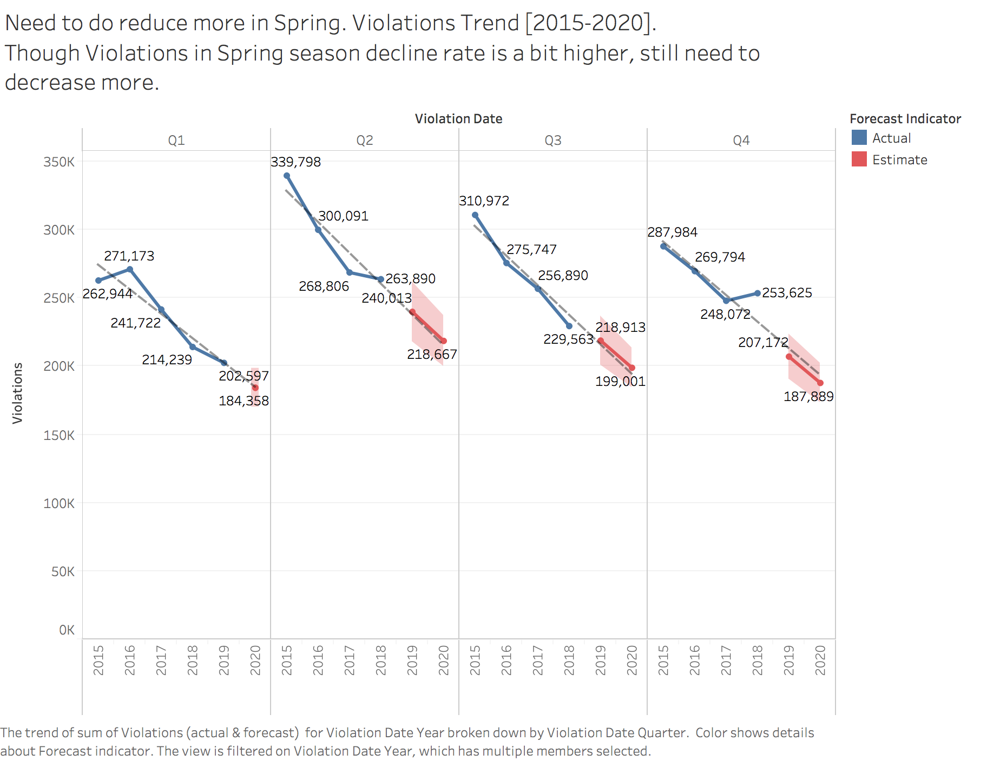
Here are the following reasons i think, this is superior to previous first version.
* Clearly shows Q2 has maximum in year 2015 of all seasons. So it starts at a higher elevation. In the previous graph, the mayor needs to look closely between Q2,Q3 and Q4.
* The Projected violations in 2019 and 2020 is clearly higher in Q2 and obvious with this form of graph.
* The decreasing rate is parallel between Q2,Q3 and Q4 which results in inference that season with maximum violation should decrease at a higher steeper rate.

I ended up with this graph as final "Interesting story" telling the mayor that Of all Seasons, Spring season has maximum violations in each year and the trend rate is more or less parallel to other quarters (slightly better). But the City needs to do more in Spring seasons to avoid fatal accidental deaths of youths and kids.

## Non-trivial Story

The Mayor might be interested in knowing the trend of violations at each zip code.
I initially came up with horizontal bars and zip code wise total violations sorted descending. 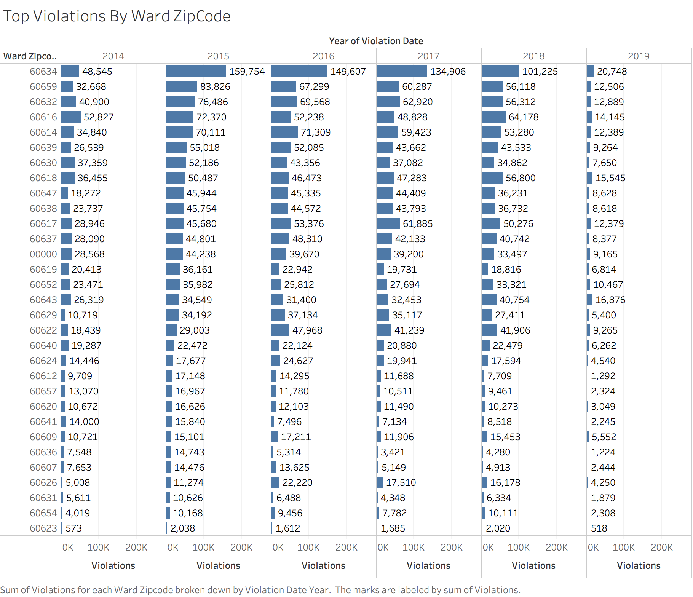

This horizontal bar graph does not depict the trend of violations but just present details of violations by zip code over years. I created another bar graph. 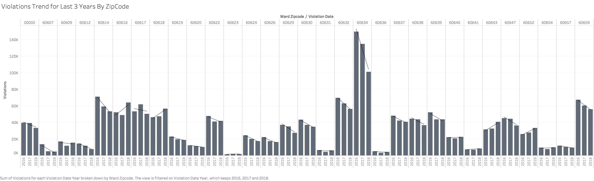
Well, the above graph is pretty good in capturing the trend (in the last three years), the mayor needs to look very closely to see which zip codes have interesting trends.

I came up with a line graph 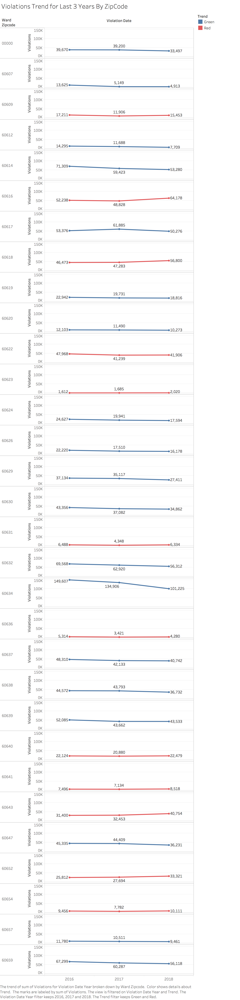 to describe this non-trivial story. I created a new parameter called it "color-line" and added the calculation "If the total violations in year 2017 is lesser than year 2018, then return 2 otherwise return 1". I also created another parameter called it "Trend" and added the calculation to return "Red" the color-line attribute is 1 otherwise "Green" (if [color-line]= 1 then "Red" elseif [color-line]=2 then "Green" end). Then I used this new attribute "Trend" in the color of the graph. The mayor can also click on "Green" or "Red" in the legend to filter and see only "Red". Here "Red" shows increasing trend in violations in the last year 2018 compared to 2017. I can show the mayor all the increasing trend zip codes in one click. This graph is compelling and persuading the mayor to take further steps to reduce violations in these zip codes. I chose this line graph with trend line over the others to tell this non-trivial and compelling story to the Mayor of Chicago. I kept this as my first version to tell a non-trivial story.

Here is my question to myself after this first version. If it's going to show zip codes with increasing trend and decreasing trend , why does he care about zip codes with decreasing trend. Why does he need to scroll down to find largest increasing trend? Can't I just present only increasing trend and that too in decreasing order of magnitude of change.

I did the following to achieve this. I created a new calculated field "change_magnitude" to get the difference between the sum of violations between the last two years 2017 and 2018 (since 2019 data is not fully provided) with the following formula (LOOKUP(sum([Violations]),last()) - lookup(sum([Violations]),(last()-1))). I created another attribute Trend_Rank to categorize the magnitude change into different buckets. The formula used for this new attribute is given below. I tried to bucket them into rank 1 to 5 based on the value of change_magnitude. If difference is >=10000
I want to put them in rank 1 bucket. Anything between 7500 to 10000 in rank 2, 7500 to 5000 in rank 3, 5000 to 2500 in rank 4, and between 2500 to 0 in rank 5. 
IF [change_magnitude] >= 10000 THEN 1
ELSEIF [change_magnitude] < 10000 AND [change_magnitude] >= 7500 THEN 2
ELSEIF [change_magnitude] < 7500 AND [change_magnitude] >= 5000 THEN 3
ELSEIF [change_magnitude] < 5000 AND [change_magnitude] >= 2500 THEN 4
ELSEIF [change_magnitude] < 2500 AND [change_magnitude] > 0 THEN 5
END

I also created another new attribute "Percentage_Change" with the following formula ((LOOKUP(sum([Violations]),last()) - lookup(sum([Violations]),(last()-1)))/LOOKUP(sum([Violations]),last()))x100 to show the percentage change between 2017 to 2018.

I started with building the graph I needed. I put YEAR dimension into columns, Ward Zipcode, Trend Rank and Sum(Violations) into Rows (Please it should follow the same order). I also set the following colors for Trend Rank in the "Highlighted selected items". 1 as Red, 2 as orange, 3 as yellow, 4 as Turquoise 5 as green.

I chose, Line graph from the "Marks" and also set the following in filters.
* YEAR to keep only 2016,2017 and 2018 (Year 2016 is kept in the graph to show trend starting a year back, but it's in any calculations).
* Trend: keep only Red to show increasing trend of violations
* Set 'change_magnitude' and choose Range of values from 1023 to 15350 (omitting any trend increase less than 1000 violations in change_magnitude to be ignored. So the Mayor will get all zip codes with the magnitude of violation increase greater than 1000 violations between 2017 and 2018).
Also set the following attributes in Marks section.
* Set 'Trend Rank' in color
* Moved 'Percentage_Change' in details
* Moved SUM(Violations) to label so it can show in the graph.

The result is 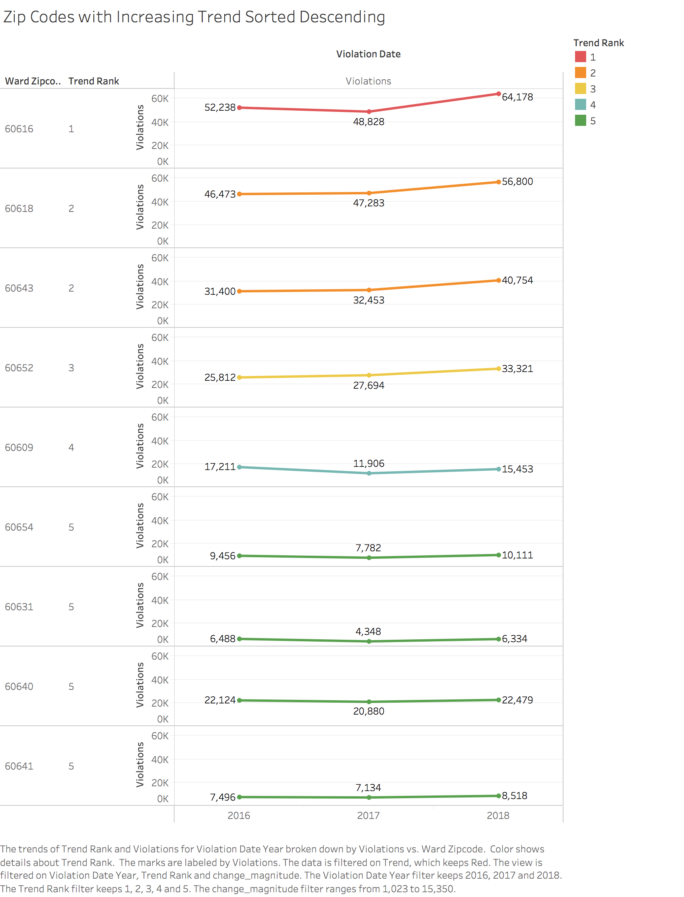. This graph is better than the previous ones in answering all the above questions. I chose this graph to tell the non-trivial story to Mayor that ZipCodes 60616,60618, 60643, 60652 have violations increase in the order of more than five thousands since the last two years. 
 
## Unexpected Story

Since the speed cameras are speed traps around children safety zones to catch local residents and visitors when commuting in this area, I strongly believe that the local residents will be the major violators for the following reasons. 
* Local residents use these roads on a day to day basis.
* Violations are maximum during Q2,Q3 and Q4 seasons in all the years, which confirm that the local residents start using these parks, children recreation areas in these seasons.
* If the violations are caused by external visitors, then it will be random effect and no pattern will be observed.

Hence I decided to calculate the average median age of residents in all the zip codes present in this speed violations dataset. I web scraped the [url](http://www.city-data.com/zips/60626.html) 
and got the "Resident Median Age" for each zip code. This website provides resident average median age for the year 2016. Since the year 2016 is in the middle , i consider it as the average median age of each zip code. I collected the information for each zip code in the City of Chicago and merged that information with the Speed violations data set.
I also web scraped average age of all zip codes from the [url](http://zipatlas.com/us/il/chicago/zip-code-comparison/median-age.htm). I found that the average age is slightly less than median age which confirms that there may be more younger population compared to median age and I safely assumed that if I target a broad range of population around the median age, we can find and explain any unexpected story from the data. I came up with initial graph (given below). 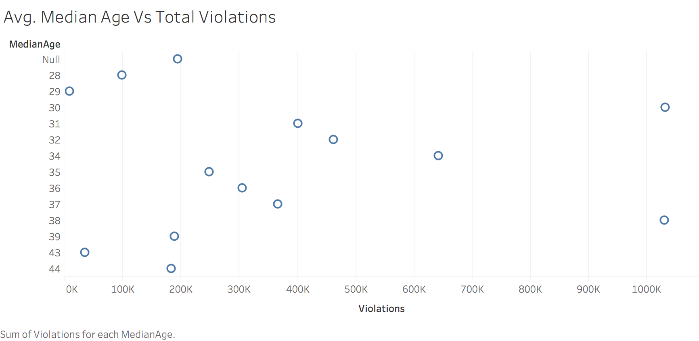. This does not portray or convey my concern. 

I came up with another line graph (given below). 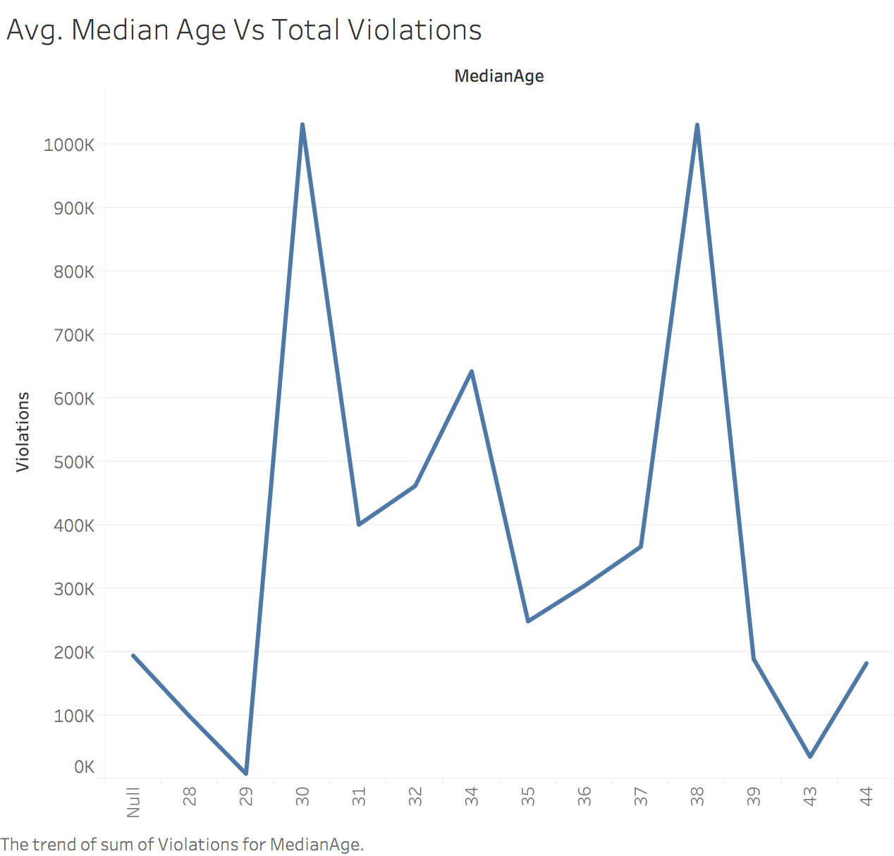 This graph is good, but the problem is it's not based from 0. So the magnitude of change or comparison is not effective.

I came up with another bar graph (given below). 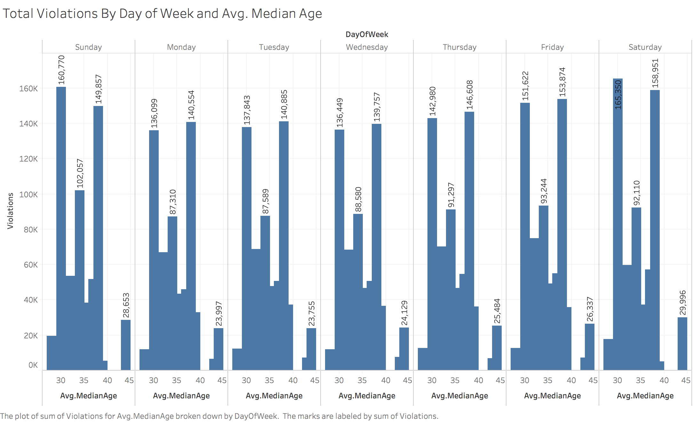 When i looked at this graph, the average median age violators are maximum in the age group between 35 to 40. I was expecting young driver population in the age group 30 to 35 will be the maximum violators. This was in contrary to my belief. I think the mayor will be very much interested to see this graph as he will be willing to take further steps by airing ads and pep talks on road safety and Children safety zone awareness among citizens. I finally chose this bar graph for this unexpected story as my first version.

When i re-reviewed this graph, I had following questions.
* Average Age Median 30 and 38 has the maximum violations.My earlier argument does not establish causal relation between violation and age especially 30 and 38. So i started adding WardZipCode to prove if two different zip codes with the same age 30 and 38 should also have maximum violations or comparable violation trend. I came up with this graph. 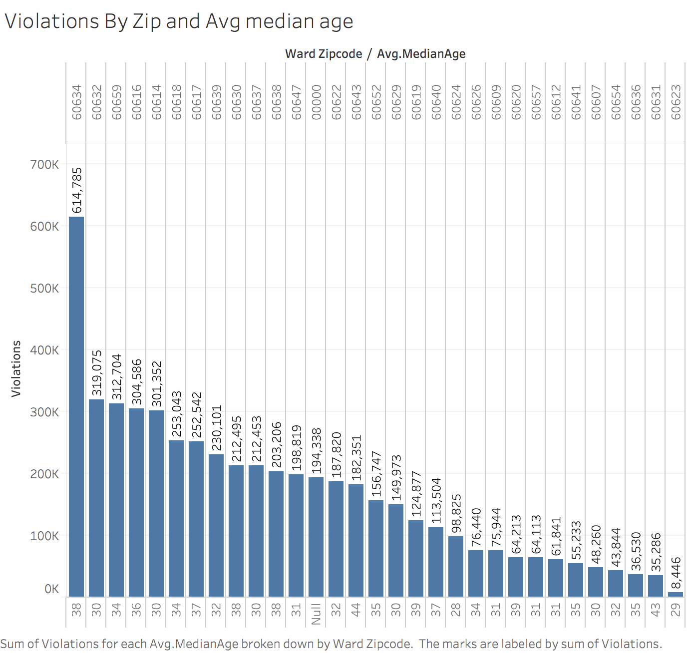

The above picture shows that there is some problem with zip code 60634 (unexpected outlier). We need to look into using CameraID dimension and review all the violations in all cameras in the top zip codes that contribute to violations.

I also web scraped average income, mean population age and average population for these zip codes from [url](http://www.city-data.com/zips/60626.html)
and merged them with violations data. The average age is very similar to median age of these zip codes. It was slightly lesser in most cases. Hence using mean age won't have any effect in our analysis. I also tried with using population, Average AGI income instead of average median age. I could not get any subtle inference like, low population or income has certain impact on speed violations. This was not clear from the data. Hence i dropped the idea of using any of these new attributes. The extra data collected for zip codes in the City of Chicago is uploaded to this repository. 

I came up with a horizontal bar graph, showing total violations by zip code in the descending order. I placed the CameraID in the size of the marks.
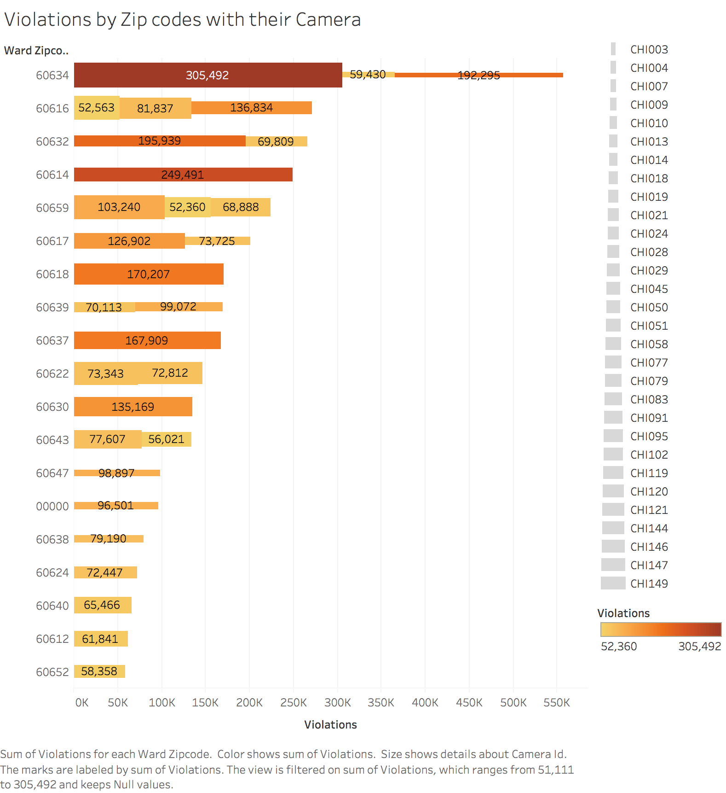

I think the above graph is the best for the following reasons.
1. Shows the zip code wise violations with break up on Camera sorted by top violations descending
2. In one single view, the Mayor gets the Zip code and the contributing Camera details and how much each Camera contribute. This is also engaging and compelling.

I chose this as final unexpected story telling aspect for the Mayor.

#Version history:
1. "Making of" the same story can be found at [First Version](https://github.com/srivasud/threeaspects/blob/master/README.md)
2. Previous version of the presentation can be found at [First Version Presentation](https://public.tableau.com/profile/srinivasan.vasudevan#!/vizhome/InduvidualProject-ThreeAspects/ThreeAspects)
